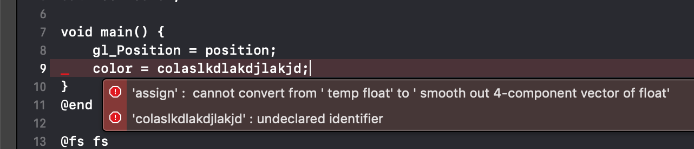

# sokol-shdc

Shader-code-generator for sokol_gfx.h

## Table of Content

- [Updates](#updates)
- [Feature Overview](#feature-overview)
- [Build Process Integration with fips](#build-process-integration-with-fips)
- [Standalone Usage](#standalone-usage)
- [Shader Tags Reference](#shader-tags-reference)
- [Programming Considerations](#programming-considerations)
- [Runtime Inspection](#runtime-inspection)

## Updates

- **30-Jul-2022**:
    - BREAKING CHANGE: renamed the ```@cimport``` tag to ```@header```, and change behaviour so that
      it inserts the literal text after ```@header``` before the generated code (e.g. no more
      target-language specific behaviour)
    - Added an Odin code generator for the official Odin bindings (https://github.com/floooh/sokol-odin)

- **14-Jun-2022**:
    - initial Nim support for use with the sokol-nim bindings
    - new tag: ```@cimport``` to pull in C headers, or Zig and Nim modules

- **07-Jan-2022**:
    - support for additional uniform types:
        - int => SG_UNIFORMTYPE_INT
        - ivec2 => SG_UNIFORMTYPE_INT2
        - ivec3 => SG_UNIFORMTYPE_INT3
        - ivec4 => SG_UNIFORMTYPE_INT4
    - add support for mixed-type uniform blocks, those will not be flattened
      for the output GLSL dialects
    - stricter checks for allowed types in uniform blocks (e.g. arrays
      are only allowed for vec4, ivec4 and mat4)

- **01-Jul-2021**:
    - A new command line option ```--reflection``` which adds a small set of
    runtime introspection functions to the generated code (currently only in the C
    code generator)
    - A new command line option ```--defines``` to pass a combination
      of preprocessor defines to the GLSL compilation pass, this can be
      used to stamp out different 'variations' from the same GLSL
      source file
    - A new command line option ```--module``` which allows to define or
      override the ```@module``` name from the command line. This is useful
      in combination with the new ```--defines``` option to make type-
      and function-names generated from the same source file unique.

- **10-Feb-2021**:
    - the C code generator has been updated for the latest API-breaking-changes
    in sokol_gfx.h
    - the generated function which returns an initialized sg_shader_desc struct
    now takes an input parameter to select the backend-specific code instead
    of calling the ```sg_query_backend()``` function
    - a code generator for the [sokol-zig bindings](https://github.com/floooh/sokol-zig/) has been
    added, used with ```--format sokol_zig```

- **03-Oct-2020**: The command line option ```--noifdef``` is now obsolete (but
  still accepted) and has been replaced with ```--ifdef```. The default
  behaviour is now to *not* wrap the generated platform specific code with
  ifdefs. If you rely on that behaviour, call sokol-shdc with the new
  ```--ifdef``` flag.

## Feature Overview

sokol-shdc is a shader-cross-compiler and -code-generator command line tool
which translates an 'annotated GLSL' source file into a C header (or other
output formats) for use with sokol-gfx.

Shaders are written in 'modern GLSL' (v450) and translated into the following
shader dialects:

- GLSL v100 (for GLES2 and WebGL)
- GLSL v300es (for GLES3 and WebGL2)
- GLSL v330 (for desktop GL)
- HLSL4 or HLSL5 (for D3D11), optionally as bytecode
- Metal (for macOS and iOS), optionally as bytecode
- WebGPU (initially SPIRV, later WGSL)

This cross-compilation happens via existing Khronos open source projects:

- [glslang](https://github.com/KhronosGroup/glslang): for compiling GLSL to SPIR-V
- [SPIRV-Tools](https://github.com/KhronosGroup/SPIRV-Tools): the SPIR-V optimizer is used
to run optimization passes on the intermediate SPIRV (mainly for dead-code elimination)
- [SPIRV-Cross](https://github.com/KhronosGroup/SPIRV-Cross): for translating the SPIRV
bytecode to GLSL dialects, HLSL and Metal

Error messages from ```glslang``` are mapped back to the original annotated
source file and converted into GCC or MSVC error formats for integration with
IDEs like Visual Studio, Xcode or VSCode:



Shader files are 'annotated' with custom **@-tags** which add meta-information to
the GLSL source files. This is used for packing vertex- and fragment-shaders
into the same source file, mark and include reusable code blocks, and provide
additional information for the C code-generation (note the ```@vs```,
```@fs```, ```@end``` and ```@program``` tags):

```glsl
@vs vs
in vec4 position;
in vec4 color0;
out vec4 color;
void main() {
    gl_Position = position;
    color = color0;
}
@end

@fs fs
in vec4 color;
out vec4 frag_color;
void main() {
    frag_color = color;
}
@end

@program triangle vs fs
```
Note: For compatibility with other tools which parse GLSL, `#pragma sokol` may be used to prefix the tags. For example, the final line above could have also been written as:

```glsl
#pragma sokol @program triangle vs fs
```

The generated C header contains:

- human-readable reflection info in a comment block, as well as
copy-pastable example code
- complete ```sg_shader_desc``` structs for each shader dialect
- for each shader program, a C function which returns a pointer to the right
```sg_shader_desc``` for the current sokol-gfx backend (including a runtime
fallback from GLES3/WebGL2 to GLES2/WebGL)
- constants for vertex attribute locations, uniform-block- and image-bind-slots
- optionally a set of C functions for runtime inspection of the generated vertex
attributes, image bind slots and uniform-block structs

For instance, creating a shader and pipeline object for the above simple *triangle*
shader program looks like this:

```c
// create a shader object from generated sg_shader_desc:
sg_shader shd = sg_make_shader(triangle_shader_desc(sg_query_backend()));

// create a pipeline object with this shader, and
// code-generated vertex attribute location constants
// (ATTR_vs_position and ATTR_vs_color0)
pip = sg_make_pipeline(&(sg_pipeline_desc){
    .shader = shd,
    .layout = {
        .attrs = {
            [ATTR_vs_position].format = SG_VERTEXFORMAT_FLOAT3,
            [ATTR_vs_color0].format = SG_VERTEXFORMAT_FLOAT4
        }
    }
});
```

## Build Process Integration with fips

sokol-shdc can be used standalone as offline-tool from the command
line, but it's much more convenient when integrated right into the
build process. That way the edit-compile-test loop for shader
programming is the same as for regular C or C++ code.

Support for [fips](https://github.com/floooh/fips) projects comes
out-of-the box. For other build systems, sokol-shdc must be called
from a custom build job, or a custom rule to build .h files from
.glsl files.

For fips projects, first add a new dependency to the ```fips.yml``` file of your project:

```yaml
...
imports:
    sokol-tools-bin:
        git: https://github.com/floooh/sokol-tools-bin
    ...
```

The [sokol-tools-bin](https://github.com/floooh/sokol-tools-bin) repository
contains precompiled 64-bit executables for macOS, Linux and Windows, and the
necessary fips-files to hook the shader compiler into the build project.

After adding the new dependency to fips.yml, fetch and update the dependencies of your project:

```bash
> ./fips fetch
> ./fips update
```

Finally, for each GLSL shader file, add the cmake macro ```sokol_shader()``` to your application- or library targets:

```cmake
fips_begin_app(triangle windowed)
    ...
    sokol_shader(triangle.glsl ${slang})
fips_end_app()
```

The ```${slang}``` variable (short for shader-language, but you can call it
any way you want) must resolve to a string with the shader dialects you want
to generate.

There are 3 other versions of the sokol_shader() macro:

- **sokol_shader_with_reflection([filename] [slang])**: this is the same as ```sokol_shader()``` but
  calls sokol-shdc with the ```--reflection``` command line option, which generates
  additional runtime inspection functions
- **sokol_shader_variant([filename] [slang] [module] [defines])**: this macro additionally passed
  the ```--module``` and ```-defines``` command line arguments and allows to create a
  conditionally compiled variant of the GLSL input file, the output file will be called
  [filename].[module].h
- **sokol_shader_variant_with_reflection([filename] [slang] [module] [defines])**: same
  as ```sokol_shader_variant()```, but additionally adds the ```--reflection``` command
  line argument for generating runtime inspection functions

I recommend to initialize the ${slang} variable together with the
target-platform defines for sokol_gfx.h For instance, the [sokol-app
samples](https://github.com/floooh/sokol-samples/tree/master/sapp) have the following
block in their CMakeLists.txt file:

```cmake
if (FIPS_EMSCRIPTEN)
    add_definitions(-DSOKOL_GLES3)
    set(slang "glsl300es:glsl100")
elseif (FIPS_RASPBERRYPI)
    add_definitions(-DSOKOL_GLES2)
    set(slang "glsl100")
elseif (FIPS_ANDROID)
    add_definitions(-DSOKOL_GLES3)
    set(slang "glsl300es")
elseif (SOKOL_USE_D3D11)
    add_definitions(-DSOKOL_D3D11)
    set(slang "hlsl5")
elseif (SOKOL_USE_METAL)
    add_definitions(-DSOKOL_METAL)
    if (FIPS_IOS)
        set(slang "metal_ios:metal_sim")
    else()
        set(slang "metal_macos")
    endif()
else()
    if (FIPS_IOS)
        add_definitions(-DSOKOL_GLES3)
        set(slang "glsl300es")
    else()
        add_definitions(-DSOKOL_GLCORE33)
        set(slang "glsl330")
    endif()
endif()
```

After preparing the CMakeLists.txt files like this, run ```fips gen```,
followed by ```fips build``` or ```fips open``` as usual.

The output C header files will be generated *out of source* in the
build directory (not the project directory where the source code under
version control resides). This is because sokol-shdc only generates
the shader dialects needed for the platform the code is compiled for, so the
generated files look different on each platform, or even build config.

## Standalone Usage

```sokol-shdc``` can be invoked from the command line to convert
one annotated-GLSL source file into one C header file.

Precompiled 64-bit executables for Windows, Linux and macOS are here:

https://github.com/floooh/sokol-tools-bin

Run ```sokol-shdc --help``` to see a short help text and the list of available options.

For a quick test, copy the following into a file named ```shd.glsl```:

```glsl
@vs vs
in vec4 pos;
void main() {
    gl_Position = pos;
}
@end

@fs fs
out vec4 frag_color;
void main() {
    frag_color = vec4(1.0, 0.0, 0.0, 1.0);
}
@end

@program shd vs fs
```

...and then run:

```bash
> ./sokol-shdc --input shd.glsl --output shd.h --slang glsl330:hlsl5:metal_macos
```

...this should generate a C header named ```shd.h``` in the current directory.

### Command Line Reference

- **-h --help**: Print usage information and exit
- **-i --input=[GLSL file]**: The path to the input GLSL file, this must be either
relative to the current working directory, or an absolute path.
- **-o --output=[C header]**: The path to the generated C header, either relative
to the current working directory, or as absolute path. The target directory must
exist.
- **-t --tmpdir=[path]**: Optional path to a directory used for storing intermediate files
when generating Metal bytecode. If no separate temporary directory is provided,
intermediate files will be written to the same directory as the generated
C header defined via *--output*. In both cases, the target directory must exist.
- **-l --slang=[shader languages]**: One or multiple output shader languages. If
multiple languages are provided, they must be separated by a **colon**. Valid
shader language names are:
    - **glsl330**: desktop GL
    - **glsl100**: GLES2 / WebGL
    - **glsl300es**: GLES3 / WebGL2
    - **hlsl4**: D3D11
    - **hlsl5**: D3D11
    - **metal_macos**: Metal on macOS
    - **metal_ios**: Metal on iOS device
    - **metal_sim**: Metal on iOS simulator
    - **wgpu**: WebGPU

  For instance, to generate header with support for all supported GLSL dialects:

  ```
  --slang glsl330:glsl100:glsl300es
  ```

- **-b --bytecode**: If possible, compile shaders to bytecode instead of
embedding source code. The restrictions to generate shader bytecode are as
follows:
    - target language must be **hlsl4**, **hlsl5**, **metal_macos** or **metal_ios**
    - sokol-shdc must run on the respective platforms:
        - **hlsl4, hlsl5**: only possible when sokol-shdc is running on Windows
        - **metal_macos, metal_ios**: only possible when sokol-shdc is running on macOS

  ...if these restrictions are not met, sokol-shdc will fall back to generating
  shader source code without returning an error. Note that the **metal_sim**
  target for the iOS simulator doesn't support generating bytecode, this
  will always emit Metal source code.
- **-f --format=[sokol,sokol_impl,sokol_decl,bare,sokol_zig]**: set output backend (default: **sokol**)
    - **sokol**: Generate a C header where data is declared as ```static``` and
      functions are declared as ```static inline```. If this header is included
      multiple times, you should be aware that the executable may contain duplicate data.
    - **sokol_impl**: This generates an STB-style header. In exactly one place where
      the header is included, the define ```SOKOL_SHDC_IMPL``` must be defined
      to compile the implementation, all other places, only the declarations
      will be included.
    - **sokol_decl**: This is a special backward-compatible mode and shouldn't
      be used. In this mode, data is declared ```static``` and functions are
      declared ```static inline```, and the implementation is included when
      the ```SOKOL_SHDC_DECL``` is *not* defined
    - In **bare** format, compiled shader code is written as plain text or binary files. For each combination of shader program and target language, a file name based on *--output* is constructed as follows:
        - **glsl**: *.frag.glsl and *.vert.glsl
        - **hlsl**: *.frag.hlsl and *.vert.hlsl, or *.fxc for bytecode
        - **metal**: *.frag.metal and *.vert.metal, or *.metallib for bytecode
    - **sokol_zig**: This generates a Zig source file that's compatible with the
      [sokol-zig bindings](https://github.com/floooh/sokol-zig/)
    - **sokol_odin**: Generates an Odin source file that's compatible with the
      [sokol-odin bindings](https://github.com/floooh/sokol-odin)

  Note that some options and features of sokol-shdc can be contradictory to (and thus, ignored by) backends. For example, the **bare** backend only writes shader code, and disregards all other information.
- **-e --errfmt=[gcc,msvc]**: set the error message format to be either GCC-compatible
or Visual-Studio-compatible, the default is **gcc**
- **-g --genver=[integer]**: set a version number to embed in the generated header,
this is useful to detect whether all shader files need to be recompiled because
the tooling has been updated (sokol-shdc will not check this though, this must be
done in the build-system-integration)
- **--ifdef**: this tells the code generator to wrap 3D-backend-specific
code into **#ifdef/#endif** pairs using the sokol-gfx backend-selection defines:
    - SOKOL_GLCORE33
    - SOKOL_GLES2
    - SOKOL_GLES3
    - SOKOL_D3D11
    - SOKOL_METAL
    - SOKOL_WGPU
- **-d --dump**: Enable verbose debug output, this basically dumps all internal
information to stdout. Useful for debugging and understanding how sokol-shdc
works, but not much else :)
- **--defines=[define1:define2:define3]**: a colon-separated list of
preprocessor defines for the initial GLSL-to-SPIRV compilation pass
- **--module=[name]**: a command-line override for the ```@module``` keyword
- **--reflection**: if present, code-generate additional runtime-inspection functions

## Shader Tags Reference

The following ```@-tags``` can be used in *annotated GLSL* source files:

### @vs [name]

Starts a named vertex shader code block. The code between
the ```@vs``` and the next ```@end``` will be compiled as a vertex shader.

Example:

```glsl
@vs my_vertex_shader
uniform vs_params {
    mat4 mvp;
};

in vec4 position;
in vec4 color0;

out vec4 color;

void main() {
    gl_Position = mvp * position;
    color = color0;
}
@end
```

### @fs [name]

Starts a named fragment shader code block. The code between the ```@fs``` and
the next ```@end``` will be compiled as a fragment shader:

Example:

```glsl
@fs my_fragment_shader
in vec4 color;
out vec4 frag_color;

void main() {
    frag_color = color;
}
@end
```

### @program [name] [vs] [fs]

The ```@program``` tag links a vertex- and fragment-shader into a named
shader program. The program name will be used for naming the generated
```sg_shader_desc``` C struct and a C function to get a pointer to the
generated shader desc.

At least one ```@program``` tag must exist in an annotated GLSL source file.

Example for the above vertex- and fragment-shader snippets:

```glsl
@program my_program my_vertex_shader my_fragment_shader
```

This will generate a C function:

```C
static const sg_shader_desc* my_program_shader_desc(void);
```

### @block [name]

The ```@block``` tag starts a named code block which can be included in
other ```@vs```, ```@fs``` or ```@block``` code blocks. This is useful
for sharing code between shaders.

Example for having a common lighting function shared between two fragment
shaders:

```glsl
@block lighting
vec3 light(vec3 base_color, vec3 eye_vec, vec3 normal, vec3 light_vec) {
    ...
}
@end

@fs fs_1
@include_block lighting

out vec4 frag_color;
void main() {
    frag_color = vec4(light(...), 1.0);
}
@end

@fs fs_2
@include_block lighting

out vec4 frag_color;
void main() {
    frag_color = vec4(0.5 * light(...), 1.0);
}
@end
```

### @end

The ```@end``` tag closes a ```@vs```, ```@fs``` or ```@block``` code block.

### @include_block [name]

```@include_block``` includes a ```@block``` into another code block.
This is useful for sharing code snippets between different shaders.

### @include [path]

Include a file from the files system. ```@include``` takes one argument:
the path of the file to be included. The path must be relative to the directory
where the top-level source file is located and must not contain whitespace or
quotes. The ```@include``` tag can appear inside or outside a code block:

```glsl
@ctype mat4 hmm_mat4

@vs vs
@include bla/vs.glsl
@end

@include fs.glsl

@program cube vs fs
```

### @ctype [glsl_type] [c_type]

The ```@ctype``` tag defines a type-mapping from GLSL to C or C++ in uniform blocks for
the GLSL types ```float```, ```vec2```, ```vec3```, ```vec4``` and ```mat4```
(these are the currently valid types for use in GLSL uniform blocks).

Consider the following GLSL uniform block without ```@ctype``` tags:

```glsl
@vs my_vs
uniform shape_uniforms {
    mat4 mvp;
    mat4 model;
    vec4 shape_color;
    vec4 light_dir;
    vec4 eye_pos;
};
@end
```

On the C side, this will be turned into a C struct like this:

```c
typedef struct shape_uniforms_t {
    float mvp[16];
    float model[16];
    float shape_color[4];
    float light_dir[4];
    float eye_pos[4];
} shape_uniforms_t;
```

But what if your C/C++ code uses a math library like HandmadeMath.h or
GLM?

That's where the ```@ctype``` tag comes in. For instance, with HandmadeMath.h
you would add the following two @ctypes at the top of the GLSL file to
map the GLSL types to their matching hmm_* types:

```glsl
@ctype mat4 hmm_mat4
@ctype vec4 hmm_vec4

@vs my_vs
uniform shape_uniforms {
    mat4 mvp;
    mat4 model;
    vec4 shape_color;
    vec4 light_dir;
    vec4 eye_pos;
};
@end
```

With this change, the uniform block struct on the C side is generated like this now:

```c
typedef struct shape_uniforms_t {
    hmm_mat4 mvp;
    hmm_mat4 model;
    hmm_vec4 shape_color;
    hmm_vec4 light_dir;
    hmm_vec4 eye_pos;
} shape_uniforms_t;
```

Note that the mapped C/C++ types must have the following byte sizes:

- ```mat4```: 64 bytes
- ```vec4```: 16 bytes
- ```vec3```: 12 bytes
- ```vec2```: 8 bytes
- ```float```: 4 bytes

Explicit padding bytes will be included as needed by the code generator.

### @header ...

The ```@header``` tag allows to inject target-language specific statements
before the generated code. This is for instance useful to include any
required dependencies.

For instance to add a **C** header include:

```glsl
@header #include "path/to/header.h"
@header #include "path/to/other_header.h"
```

This will result in the following generated C code:

```c
#include "path/to/header.h"
#include "path/to/other_header.h"
```

### @module [name]

The optional ```@module``` tag defines a 'namespace prefix' for all generated
C types, values, defines and functions.

For instance, when adding a ```@module``` tag to the above @ctype-example:

```glsl
@module bla

@ctype mat4 hmm_mat4
@ctype vec4 hmm_vec4

@vs my_vs
uniform shape_uniforms {
    mat4 mvp;
    mat4 model;
    vec4 shape_color;
    vec4 light_dir;
    vec4 eye_pos;
};
@end
```

...the generated C uniform block struct (allong with all other identifiers)
would get a prefix ```bla_```:

```c
typedef struct bla_shape_uniforms_t {
    hmm_mat4 mvp;
    hmm_mat4 model;
    hmm_vec4 shape_color;
    hmm_vec4 light_dir;
    hmm_vec4 eye_pos;
} bla_shape_uniforms_t;
```

### @glsl_options, @hlsl_options, @msl_options

These tags can be used to define per-shader/per-language options for SPIRV-Cross
when compiling SPIR-V to GLSL, HLSL or MSL.

GL, D3D and Metal have different opinions where the origin of an image
is, or whether clipspace-z goes from 0..+1 or from -1..+1, and the
option-tags allow fine-control over those aspects with the following
arguments:

- **fixup_clipspace**:
    - GLSL: In vertex shaders, rewrite [0, w] depth (Vulkan/D3D style) to [-w, w] depth (GL style).
    - HLSL: In vertex shaders, rewrite [-w, w] depth (GL style) to [0, w] depth.
    - MSL: In vertex shaders, rewrite [-w, w] depth (GL style) to [0, w] depth.
- **flip_vert_y**: Inverts gl_Position.y or equivalent. (all shader languages)

Currently, ```@glsl_options```, ```@hlsl_options``` and ```@msl_options``` are only
allowed inside ```@vs, @end``` blocks.

Example from the [mrt-sapp sample](https://floooh.github.io/sokol-html5/wasm/mrt-sapp.html),
this renders a fullscreen-quad to blit an offscreen-render-target image to screen,
which should be flipped vertically for GLSL targets:

```glsl
@vs vs_fsq
@glsl_options flip_vert_y
...
@end
```

## Programming Considerations

### Target Shader Language Defines

In the input GLSL source, use the following checks to conditionally
compile code for the different target shader languages:

```GLSL
#if SOKOL_GLSL
    // target shader language is a GLSL dialect
#endif

#if SOKOL_HLSL
    // target shader language is HLSL
#endif

#if SOKOL_MSL
    // target shader language is MetalSL
#endif

#if SOKOL_WGPU
    // target shader language is SPIRV/WGSL
#endif
```

Normally, SPIRV-Cross does its best to 'normalize' the differences between
GLSL, HLSL and MSL, but sometimes it's still necessary to write different
code for different target languages.

These checks are evaluated by the initial compiler pass which compiles
GLSL v450 to SPIR-V, and only make sense inside ```@vs```, ```@fs```
and ```@block``` code-blocks.

### Creating shaders and pipeline objects

The generated C header will contain one function for each shader program
which returns a pointer to a completely initialized static sg_shader_desc
structure, so creating a shader object becomes a one-liner.

For instance, with the following ```@program``` in the
GLSL file:

```glsl
@program shape vs fs
```

The following code would be used to create the shader object:
```c
sg_shader shd = sg_make_shader(shape_shader_desc());
```

When creating a pipeline object, the shader code generator will
provide integer constants for the vertex attribute locations.

Consider the following vertex shader inputs in the GLSL source code:

```glsl
@vs vs
in vec4 position;
in vec3 normal;
in vec2 texcoords;
...
@end
```

The vertex attribute description in the ```sg_pipeline_desc``` struct
could look like this (note the attribute indices names ```ATTR_vs_position```, etc...):

```c
sg_pipeline pip = sg_make_pipeline(&(sg_pipeline_desc){
    .layout = {
        .attrs = {
            [ATTR_vs_position].format = SG_VERTEXFORMAT_FLOAT3,
            [ATTR_vs_normal].format = SG_VERTEXFORMAT_BYTE4N,
            [ATTR_vs_texcoords].format = SG_VERTEXFORMAT_SHORT2
        }
    },
    ...
});
```

It's also possible to provide explicit vertex attribute location in the
shader code:

```glsl
@vs vs
layout(location=0) in vec4 position;
layout(location=1) in vec3 normal;
layout(location=2) in vec2 texcoords;
...
@end
```

When the shader code uses explicit location, the generated location
constants can be ignored on the C side:

```c
sg_pipeline pip = sg_make_pipeline(&(sg_pipeline_desc){
    .layout = {
        .attrs = {
            [0].format = SG_VERTEXFORMAT_FLOAT3,
            [1].format = SG_VERTEXFORMAT_BYTE4N,
            [2].format = SG_VERTEXFORMAT_SHORT2
        }
    },
    ...
});
```

### Binding uniforms blocks

Similar to the vertex attribute location constants, the C code generator
also provides bind slot constants for images and uniform blocks.

Consider the following uniform block in GLSL:

```glsl
uniform vs_params {
    mat4 mvp;
};
```

The C header code generator will create a C struct and a 'bind slot' constant
for the uniform block:

```c
#define SLOT_vs_params (0)
typedef struct vs_params_t {
    hmm_mat4 mvp;
} vs_params_t;
```

...which both are used in the ```sg_apply_uniforms()``` call like this:

```c
vs_params_t vs_params = {
    .mvp = ...
};
sg_apply_uniforms(SG_SHADERSTAGE_VS, SLOT_vs_params, &SG_RANGE(vs_params));
```

The GLSL uniform block can have an explicit bind slot:

```glsl
layout(binding=0) uniform vs_params {
    mat4 mvp;
};
```

In this case the generated bind slot constant can be ignored since it has
been explicitly defined as 0:

```c
vs_params_t vs_params = {
    .mvp = ...
};
sg_apply_uniforms(SG_SHADERSTAGE_VS, 0, &SG_RANGE(vs_params));
```

### Binding images

When using a texture sampler in a GLSL vertex- or fragment-shader like this:

```glsl
uniform sampler2D tex;
...
```

The C header code generator will create bind-slot constants with the same
naming convention as uniform blocks:

```C
#define SLOT_tex (0)
```

This is used in the ```sg_bindings``` struct as index into the ```vs_images```
or ```fs_images``` bind slot array:

```c
sg_apply_bindings(&(sg_bindings){
    .vertex_buffers[0] = vbuf,
    .fs_images[SLOT_tex] = img
});
```

Just like with uniform blocks, texture sampler bind slots can
be defined explicitly in the GLSL shader:

```glsl
layout(binding=0) uniform sampler2D tex;
...
```

...in this case the code-generated bind-slot constant can be ignored:

```c
sg_apply_bindings(&(sg_bindings){
    .vertex_buffers[0] = vbuf,
    .fs_images[0] = img
});
```

### GLSL uniform blocks and C structs

There are a few caveats with uniform blocks:

- The memory layout of uniform blocks on the CPU side must be compatible
  across all sokol-gfx backends. To achieve this, uniform block content
  is restricted to a subset of the std140 packing rule that's compatible
  with the glUniform() functions.

- Uniform block member types are restricted to:
    - float
    - vec2
    - vec3
    - vec4
    - int
    - ivec2
    - ivec3
    - ivec4
    - mat4

    This restriction exists so that the uniform data is compatible
    with all sokol_gfx.h backends down to GLES2 and WebGL.

- Arrays are only allowed for the following types:
    - vec4
    - int4
    - mat4

    This restriction exists because the element stride must
    be the same as the element width so that the uniform data
    is compatible both with the std140 layout and glUniformNfv() calls.

- Uniform block member alignment is as follows (compatible with std140):
    - float, int:   4 bytes
    - vec2, ivec2:  8 bytes
    - vec3, ivec3:  16 bytes
    - vec4, ivec4:  16 bytes
    - mat4:         16 bytes
    - vec4[]        16 bytes
    - ivec4[]       16 bytes
    - mat4[]        16 bytes

- For the GLSL outputs, uniform blocks will be flattened into a single
  vec4 arrays if all elements in the uniform block have the same
  'base type' (float or int):
    - 'float' base type: float, vec2, vec3, vec4, mat4
    - 'int' base type: int, ivec2, ivec3, ivec4

  The advantage of flattened uniform blocks is that they can be updated
  with a single glUniform4fv() call.

  Mixed-base-type uniform blocks are allowed, but will not be flattened, this
  means that such mixed uniform blocks require multiple glUniform() calls.

  If the performance of uniform block updates matters in the GL backends, it
  may make sense to split complex uniform blocks into two separate blocks with
  the same base type (e.g. all 'float-y' members into one uniform block, and
  all 'int-y' members into another).

  In the non-GL sokol-gfx backends (D3D11, Metal, WebGPU), uniform block
  updates are always a a single operation.


## Runtime Inspection

The hardwired uniform-block C structs and bind slot constants which are
code-generated by default may be too inflexible for some use cases like
high-level material system where different shaders must be fed from the
same superset of vertex components, buffers, textures and uniformblocks, but
each shader accepts a slightly different set of these inputs.

For such usage scenarios, sokol-shdc offers the ```--reflection``` command line
option which code-generates additional functions for runtime inspection of
vertex attributes, image bind slots, uniform-blocks and their layout.

The functions are prefixed by the module name (defined with the ```@module``` tag
or ```--module``` command line arg) and the shader program name:

### Vertex Attribute Inspection

The function

**int [mod]_[prog]_attr_slot(const char\* attr_name)**

returns the vertex-layout slot-index of a vertex attribute by name, or **-1** if the shader program doesn't have a vertex attribute by this name.

Example code:

```c
// setup a runtime-dynamic vertex layout
sg_layout_desc layout = {
    .buffers[0].stride = sizeof(my_vertex_t)
}

// inspect the shader what vertex attribute it actually needs
// this assumes that the shader's @module name is 'mod' and
// the @program name is 'prog':
const int pos_slot = mod_prog_attr_slot("position");
if (pos_slot >= 0) {
    layout.attrs[pos_slot] = { ... };
}
const int nrm_slot = mod_prog_attr_slot("normal");
if (nrm_slot >= 0) {
    layout.attrs[nrm_slot] = { ... };
}
const int uv_slot = mod_prog_attr_slot("texcoord");
if (uv_slot >= 0) {
    layout.attrs[uv_slot] = { ... };
}

// ...use the vertex layout in sg_pipeline_desc:
sg_pipeline_desc pip_desc = {
    .layout = layout,
    ...
};
```

### Image Bind Slot Inspection

The function

**int [mod]_[prog]_image_slot(sg_shader_stage stage, const char\* img_name)**

returns the bind-slot of an image on the given shader stage, or -1 if the
shader doesn't expect an image of that name on that shader stage.

Code example:

```c
sg_image specular_texture = ...;
sg_bindings binds = { ... };

// check if the shader expects a specular texture on the fragment shader stage,
// if yes set it in the bindings struct at the expected slot index:
const int spec_tex_slot = mod_prog_image_slot(SG_SHADERSTAGE_FS, "spec_tex");
if (spec_tex_slot >= 0) {
    binds.fs_images[spec_tex_slot] = specular_texture;
}

// apply bindings
sg_apply_bindings(&binds);
```

### Uniform Block Inspection

The function

**int [mod]_[prog]_uniformblock_slot(sg_shader_stage stage, const char\* ub_name)**

returns the bind slot of a shader's uniform block on the given shader stage, or -1
if the shader doesn't expect a uniform block of that name on that shader stage.

The function

**size_t [mod]_[prog]_uniformblock_size(sg_shader_stage stage, const char\* ub_name)**

return the size in bytes of a shader's uniform block on the given shader stage, or 0
if the shader doesn't expect a uniform block of that name on that shader stage.

Use the return values in the ```sg_apply_uniform()``` call.

Code example:

```c
// NOTE: in real-world code you'd probably want to lookup the uniform block
// slot and size upfront in initialization code, not in the hot path
const int ub_slot = prog_mod_uniformblock_slot(SG_SHADERSTAGE_VS, "vs_params");
if (ub_slot >= 0) {
    const size_t ub_size = prog_mod_uniformblock_size(SG_SHADERSTAGE_VS, "vs_params");
    sg_apply_uniforms(SG_SHADERSTAGE_VS, ub_slot, &(sg_range){
        .ptr = pointer_to_uniform_data,
        .size = ub_size
    });
}
```

The function

**int [mod]_[prog]_uniform_offset(sg_shader_stage stage, const char\* ub_name, const char\* u_name)**

...allows to lookup the byte offset of a specific uniform within its uniform block.
This makes it possible to compose uniform data expected by a shader without the
hardwired uniform block C struct. The function returns -1 if the shader doesn't expect
a uniform block of that name on that shader stage, or if the uniform block is expected
but doesn't contain a uniform of that name.

It's also possible to query the ```sg_shader_uniform_desc``` struct of a given uniform, which
provides additional type information with the following function:

**sg_shader_uniform_desc [mod]_[prog]_uniform_desc(sg_shader_stage stage, const char\* ub_name, const char\* u_name)**

The ```sg_shader_uniform_desc``` struct allows to inspect the uniform type (```SG_UNIFORMTYPE_xxx```), and the array count of the uniform (which is 1 for regular
uniforms, or >1 for arrays).
